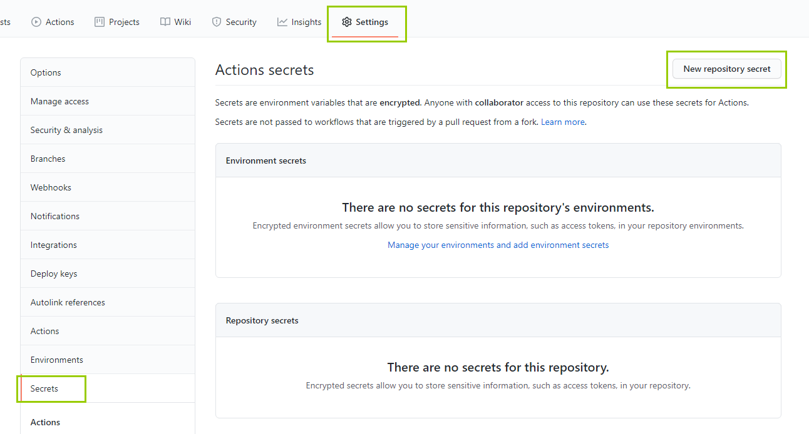
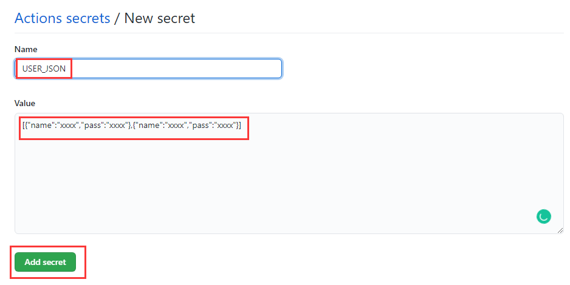
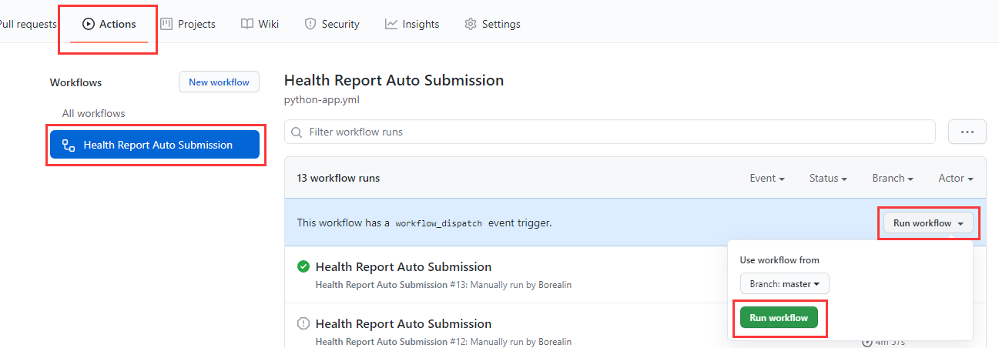

# ZJU Health Report Auto Submission
浙江大学每日健康打卡任务，通过使用Github Action定时任务完成，无需配置服务器
## 使用方法
fork项目并通过项目Setting进行项目Secret的配置：



通过配置`USER_JSON`的secret变量进行用户的管理，通过如下json格式进行配置，可添加多个用户

```json
[{"name":"xxxx","pass":"xxxx"},{"name":"xxxx","pass":"xxxx"}]
```



配置好后进入项目的Github Action页面run workflow进行测试和第一次运行加载依赖等



运行成功后每天就会在凌晨的12:15进行自动打卡了

## 定时调整

如果需要调整定时打卡时间，可以进入`.github/workflows/python-app.yml`进行修改，按照cron的规则进行配置，注意github运行时间以UTC +0为基准，中国时间为UTC +8，配置时间时应注意小时数-8:

```yml
on:
  schedule:
    - cron: '15 16 * * *'
```

## 打卡结果推送

### Server酱

通过Server酱官网注册并获取send key: https://sct.ftqq.com/ ，根据需求自行配置下发途径

在项目secret中配置`SCT_SEND_KEY`变量，值为用户send key

## Email

目前使用的是https://email.berfen.com/ 的email接口，需要注册账户并申请token（免费），

在项目secret中配置`EMAIL`变量，值为目标邮箱，配置`EMAIL_TOKEN`变量，值为上述网站token

亦可自行配置github action，如https://github.com/dawidd6/action-send-mail ，自行配置打卡结果输出至文件并通过smtp发送邮件